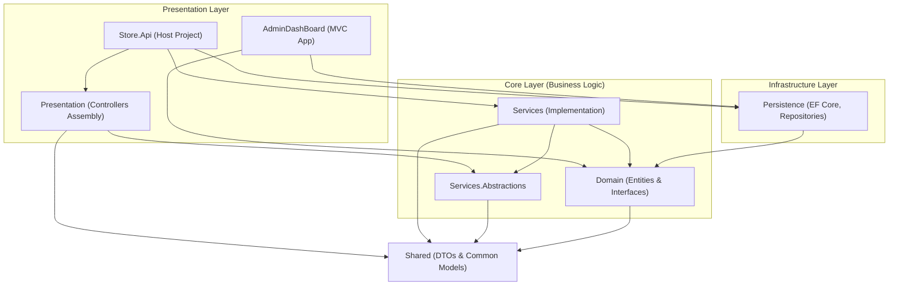

# 🛒 E-Commerce & Admin Dashboard Solution

[](https://dotnet.microsoft.com/)
[](https://www.microsoft.com/sql-server)
[](https://redis.io/)
[](https://stripe.com/)

A modern, production-ready E-commerce Web API and Admin Dashboard solution built using **Clean Architecture** principles and **Domain-Driven Design (DDD)** concepts in **ASP.NET Core**.

This repository contains two main entry-point applications:
1. **Store.Api**: A fully-featured RESTful Web API for customers, supporting shopping baskets, orders, identity authentication, dynamic filtering/sorting, Stripe payments, and Redis-based caching.
2. **AdminDashBoard**: An ASP.NET Core MVC-based dashboard for store administrators to manage the catalog (products, brands), users, and role permissions.

---

## 🏗️ Architecture Design

The project is structured following **Clean Architecture** to ensure low coupling, high testability, and independence from external databases or frameworks.



### Project Breakdowns
* **`Core/Domain`**: Contains base entities, business models (e.g., `Product`, `Order`, `CustomerBasket`), custom exceptions, and core repository/specification interfaces.
* **`Core/Services.Abstractions`**: Declares service interfaces defining application use cases (e.g., `IProductService`, `IPaymentService`, `IOrderService`).
* **`Core/Services`**: Implements business services, AutoMapper mapping configurations, and query specification classes.
* **`Infrastructure/Persistence`**: Contains Entity Framework Core DbContexts, repository implementations (Generic Repository, Unit of Work, Redis Basket/Cash repositories), and automatic database migration & seeding.
* **`Infrastructure/Presentation`**: Houses the API controllers (e.g., `ProductsController`, `AuthController`), keeping the main Web API project clean and decoupling controller routers.
* **`Shared`**: Contains lightweight Data Transfer Objects (DTOs), pagination request/response wrappers, and generic error response models.

---

## ✨ Key Features

### 🛍️ Client & Customer API (`Store.Api`)
* **Dynamic Product Catalog**: Filtering by brand/type, searching, multi-criteria sorting (price, name), and server-side pagination using the **Specification Pattern**.
* **Redis Basket Management**: High-performance shopping cart management stored in Redis with custom Time-To-Live (TTL) configuration.
* **Stripe Payments Integration**: Server-side processing of Stripe `PaymentIntent`s. It securely queries database prices to calculate the checkout amount, preventing customer-side price tampering.
* **Smart Caching**: A custom `[Cash(durationInSeconds)]` action filter caching controller responses dynamically using Redis key-value stores.
* **Authentication & Identity**: User register/login flow using ASP.NET Core Identity, backed by JWT token generation and validation.
* **Global Error Handling**: Middleware that intercepts exceptions globally, transforming them into standardized API error responses (`ValidationErrorResponse`, `ErrorDetails`).

### 🛠️ Admin Dashboard (`AdminDashBoard`)
* **Role Management**: SuperAdmins can create, edit, delete, and assign security roles.
* **User Administration**: View and manage user details and permissions.
* **Catalog Management**: Read, create, update, and delete products and product brands.
* **Interactive UI**: Styled using the *SB Admin Bootstrap 5* template, complete with responsive sidebars, FontAwesome icons, and simple datatables.

---

## 🛠️ Tech Stack & Packages

* **Backend Framework**: ASP.NET Core (.NET 8.0)
* **ORM & Databases**: EF Core 8.0, Microsoft SQL Server, Redis
* **Identity & Security**: Microsoft.AspNetCore.Identity.EntityFrameworkCore, Microsoft.AspNetCore.Authentication.JwtBearer
* **Payments**: Stripe.net
* **Caching**: StackExchange.Redis
* **Documentation**: Swagger / OpenAPI
* **Utilities**: AutoMapper, System.Text.Json
* **Frontend (Dashboard)**: Razor Views, Bootstrap 5, FontAwesome, jQuery

---

## 🚀 Getting Started

### 1. Prerequisites
Before running the solution, ensure you have the following installed:
* [.NET 8.0 SDK](https://dotnet.microsoft.com/download/dotnet/8.0)
* [SQL Server (LocalDB or Express)](https://www.microsoft.com/en-us/sql-server/sql-server-downloads)
* [Redis Server](https://redis.io/downloads/) (Running locally on port `6379`)
* A [Stripe Developer Account](https://stripe.com/) (for payment gateway functionality)

### 2. Configuration Setup
Configure your settings in the configuration files of both executable projects.

#### For `Store.Api/appsettings.json`:
```json
{
  "ConnectionStrings": {
    "DefaultConnection": "Server=.;Database=Store;Trusted_Connection=True;TrustServerCertificate=True;MultipleActiveResultSets=true",
    "Redis": "localhost:6379",
    "IdentityConnection": "Server=.;Database=Store.Identity;Trusted_Connection=True;TrustServerCertificate=True;MultipleActiveResultSets=true"
  },
  "BaseUrl": "https://localhost:7040",
  "JwtOptions": {
    "Issure": "https://localhost:7040",
    "Audience": "MyAudiance",
    "DurationInDays": 5,
    "SecretKey": "YOUR_SUPER_SECRET_JWT_KEY_MIN_32_CHARACTERS"
  },
  "StripeSettings": {
    "SecretKey": "sk_test_YOUR_STRIPE_SECRET_KEY"
  }
}
```

#### For `AdminDashBoard/appsettings.json`:
Ensure the Connection Strings match those in the API configuration.

### 3. Database Seeding & First Run
The application has a built-in automatic seeder (`DbInitializer.cs`) that applies pending Entity Framework migrations and inserts default seed data on startup (Product Brands, Types, Products, Delivery Methods, and Identity Roles/Users).

Simply run the API or Dashboard project, and the database will construct itself.

#### Default Admin Credentials:
| Account Role | Email | Password |
|---|---|---|
| **Super Admin** | `SuperAdmin@gmail.com` | `P@ssw0rd` |
| **Admin** | `Admin@gmail.com` | `P@ssw0rd` |

---

## 🏃 Run Commands

Run the API:
```bash
cd Store.Api
dotnet run
```
Access the Swagger documentation at: `https://localhost:7040/swagger/index.html` (or the HTTP alternative port outputted in the console).

Run the Admin Dashboard:
```bash
cd AdminDashBoard
dotnet run
```
Access the dashboard in your browser at the local port specified by the startup configuration (e.g., defaults to `Admin/Login` view).

---

## 🗂️ Project Structure Details

- `Core/`
  - `Domain/` - Represents the domain layer. Contains entities, value objects, and repository specifications.
  - `Services/` - Implements the service contracts and encapsulates application-specific business logic.
  - `Services.Abstractions/` - Loose coupling interface boundaries for API and Dashboard integration.
- `Infrastructure/`
  - `Persistence/` - Implements DB access, Entity Framework configurations, migrations, unit of work, and Redis repositories.
  - `Presentation/` - Holds Web API controller endpoints to isolate routing from the entry-point executable.
- `Store.Api/` - Configures middle-wares, authentications, CORS, dependency injections, and hosts the API.
- `AdminDashBoard/` - Admin panel built with ASP.NET Core MVC.
- `Shared/` - Shared objects across API, presentation and services layers.
